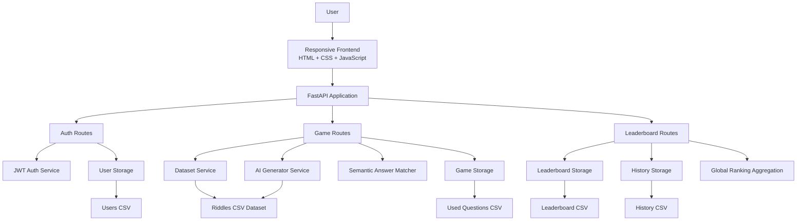
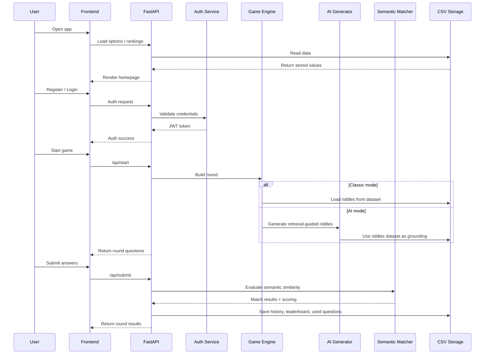

<div align="center">


<p align="center">
  <strong>Where classic brain teasers meet intelligent gameplay.</strong>
</p>

<div align="center">

<!-- Tech Stack -->


<br/><br/>

<!-- Features -->


</div>

</div>

---

## Overview

**Riddle Quiz Game** is a full-stack interactive quiz platform designed to go far beyond a basic riddle app.  
It combines:

- classic dataset-driven gameplay
- AI-assisted riddle generation
- semantic answer matching
- user authentication with JWT
- leaderboard, history, and global ranking systems
- a polished responsive interface optimized for tablet portrait and landscape layouts

This project was built to demonstrate strong skills across:

- backend engineering
- API design
- AI integration
- frontend interaction design
- responsive UI architecture
- product thinking

---

## Core Features

### Gameplay
- Classic riddle rounds
- AI-generated riddle rounds
- Multiple game modes
- Difficulty selection: Easy, Medium, Hard
- Category selection: Logic, Math, Science
- Timer-based question flow
- Hint support
- Skip question option
- Animated score display

### Intelligence Layer
- Retrieval-guided AI riddle generation
- Semantic answer scoring
- Similarity-aware evaluation beyond exact match
- Cached and reusable AI-assisted flow
- Riddle dataset conversion and deduplication

### User System
- Account creation
- Login and logout
- JWT-based authentication
- Avatar selection
- Personalized gameplay identity

### Progress and Rankings
- Leaderboard
- Recent game history
- Global ranking
- Streak tracking
- Accuracy tracking
- Score tracking by round

### UI / UX
- Premium gradient-based theme
- Animated hero title
- Slide-in account sidebar
- Responsive orientation-aware layout
- Tablet portrait and landscape optimization
- Smooth transitions and micro-interactions

---

## Why This Project Stands Out

This is not just a quiz app.

It is a **multi-layered software project** that combines:

- structured backend logic
- intelligent content generation
- semantic evaluation
- account systems
- persistent storage
- responsive interface design

It shows the ability to build a product that feels closer to a real platform than a classroom exercise.

---

## Tech Stack

### Backend
- Python
- FastAPI
- Uvicorn

### Frontend
- HTML
- CSS
- JavaScript

### Authentication
- JWT
- `python-jose`
- `passlib`

### AI / NLP
- Transformers
- Sentence Transformers
- Semantic similarity scoring

### Data Storage
- CSV-based persistence for:
  - users
  - leaderboard
  - history
  - used questions
  - riddles dataset

---

## Project Structure

```text
Riddle-AI/
│
├── app/
│   ├── main.py
│   ├── routes/
│   │   ├── auth.py
│   │   ├── game.py
│   │   └── leaderboard.py
│   │
│   ├── services/
│   │   ├── auth_service.py
│   │   ├── dataset.py
│   │   ├── generator.py
│   │   ├── retrieval.py
│   │   ├── answer_matcher.py
│   │   └── storage.py
│   │
│   ├── static/
│   │   ├── style.css
│   │   └── app.js
│   │
│   └── templates/
│       └── index.html
│
├── data/
│   ├── riddles.csv
│   ├── leaderboard.csv
│   ├── history.csv
│   ├── used_questions.csv
│   └── users.csv
│
├── riddles.txt
├── convert_riddles.py
├── requirements.txt
├── LICENSE
└── README.md
```
---

## System Architecture

---

## Request Flow

---

## Game Modes

**1. Classic**
- Uses the structured local riddle dataset.

**2. AI**
- Uses retrieval-guided generation built from the local riddle dataset.

**3. Timed**
- Adds stronger time pressure to each question.

**4. Sudden Death**
- A mistake can end the round early.

**5. Endless**
- Extends the challenge format for repeated play.

---

## Dataset Pipeline

This project supports dataset growth through a text-to-CSV conversion flow.

**Input:**

```difficulty|question|answer```

**Conversion**
- reads from ```riddles.txt```
- removes duplicates
- infers category
- writes cleaned rows to ```data/riddles.csv```

**Categories**
- Logic
- Math
- Science

This gives the project a maintainable content pipeline instead of hardcoded questions.

---

## Authentication Architecture

The authentication system uses:
- registration
- login
- password hashing
- JWT token generation
- protected API endpoints

Protected endpoints require a valid token before a user can:
- start a game
- submit results
- access personalized identity state

---

## Semantic Scoring

Instead of relying only on strict string equality, the project supports semantic-aware answer evaluation.

This makes the game more intelligent by allowing:

- better handling of close answers
- more flexible evaluation logic
- stronger NLP integration

That moves the project beyond a simple quiz checker into a more modern intelligent system.

---

## Responsive Design Strategy

The UI was designed with orientation-aware behavior in mind.
