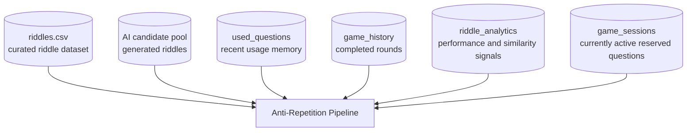
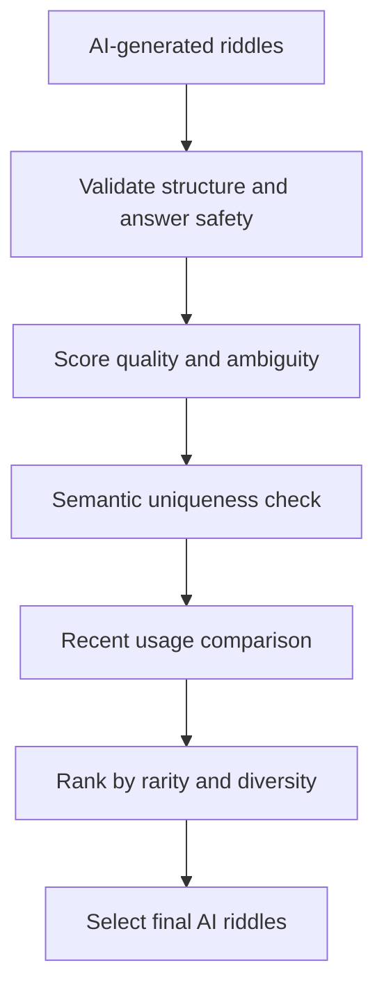
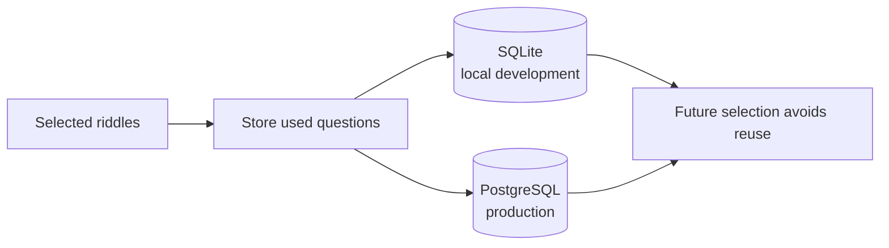

# Anti-Repetition System

This document defines the **intelligence layer responsible for preventing repetition** across all gameplay modes.

It is not just filtering; it is a **multi-layer diversity engine** combining:

- recency tracking
- semantic uniqueness
- answer diversity
- fatigue decay
- probabilistic ranking
- fallback recovery

The purpose of this system is to ensure that the player receives rounds that feel fresh, fair, and meaningfully varied.

---

## Core Objectives

The Anti-Repetition System is designed to:

- Prevent **recent question reuse**
- Prevent **semantic duplicates**
- Reduce **answer repetition patterns**
- Promote **rarity and diversity**
- Maintain **playability under constraints**
- Work consistently across **all modes**
- Avoid predictable riddle selection
- Support both curated and AI-generated riddles

---

## Why This System Matters

A riddle game can quickly become weak if the same questions, answers, or patterns appear repeatedly.

Without anti-repetition logic:

- players can memorize answers
- leaderboard results become less meaningful
- badge progression becomes easier to exploit
- AI mode may generate repeated concepts
- gameplay feels stale

The Anti-Repetition System protects the integrity of the game by making each round feel intentionally selected rather than randomly pulled.

---

## Data Sources



---

## Persistent Storage

The system supports two database environments:

<div align="center">
  
| **Environment** | **Storage** |
|-----------------|-------------|
| Local development | SQLite |
| Production | PostgreSQL |

</div>

The same anti-repetition logic operates through the persistence abstraction layer, allowing the game to behave consistently across environments.

---

## System Architecture

The anti-repetition system is composed of five main layers:

<div align="center">

| **Layer** | **Purpose** |
|-----------|-------------|
| Hard Filters | Remove exact duplicates, invalid items, and banned questions |
| Semantic Filters | Remove meaning-level duplicates |
| Recency Control | Avoid recently used or currently reserved questions |
| Ranking Engine | Prefer rare, high-quality, low-fatigue candidates |
| Diversity Selection | Enforce answer, category, and difficulty spread |

</div>
---

## Full Selection Pipeline

```mermaid 
flowchart TD

START["Request riddles"] --> MODE["Selected mode<br/>classic · timed · sudden death · endless · scenarios · AI"]

MODE --> LOAD["Load candidate source"]

LOAD --> SOURCE_CHECK{"Source type?"}

SOURCE_CHECK -- "Curated" --> RIDDLES[("riddles.csv<br/>curated dataset")]
SOURCE_CHECK -- "AI" --> AI_POOL[("AI candidate pool<br/>generated · refined · validated riddles")]

RIDDLES --> RAW_POOL["Raw candidate pool"]
AI_POOL --> RAW_POOL

%% =====================================================
%% HARD FILTERING
%% =====================================================
RAW_POOL --> FILTER_DIFF["Filter by difficulty"]
FILTER_DIFF --> FILTER_CAT["Filter by category"]
FILTER_CAT --> FILTER_MODE["Apply mode rules<br/>round size · timing · scenario constraints"]

FILTER_MODE --> REMOVE_BANNED["Remove banned questions<br/>exact keys · active reservations"]

USED[("used_questions<br/>recent usage log")]
SESSIONS[("game_sessions<br/>active reserved questions")]

USED --> REMOVE_BANNED
SESSIONS --> REMOVE_BANNED

%% =====================================================
%% SEMANTIC DEDUPLICATION
%% =====================================================
REMOVE_BANNED --> SEMANTIC["Semantic uniqueness layer"]

SEMANTIC --> SIM_CHECK["Compare candidates<br/>normalized key · token overlap · answer similarity"]

SIM_CHECK --> SEM_DECISION{"Duplicate or near-duplicate?"}

SEM_DECISION -- "Yes" --> DROP_DUP["Discard candidate"]
SEM_DECISION -- "No" --> SEM_POOL["Semantic-clean pool"]

%% =====================================================
%% RECENCY CONTROL
%% =====================================================
SEM_POOL --> RECENT_FILTER["Recency control<br/>avoid recently used questions and answers"]

HISTORY[("game_history<br/>completed round history")]
ANALYTICS[("riddle_analytics<br/>performance signals")]

HISTORY --> RECENT_FILTER
ANALYTICS --> RECENT_FILTER

RECENT_FILTER --> ENOUGH_RECENT{"Enough candidates after recency filter?"}

ENOUGH_RECENT -- "No" --> RELAX_RECENCY["Relax recency window<br/>keep hard bans"]
RELAX_RECENCY --> RECENT_POOL["Recovered candidate pool"]

ENOUGH_RECENT -- "Yes" --> RECENT_POOL

%% =====================================================
%% RANKING ENGINE
%% =====================================================
RECENT_POOL --> SCORE_CANDIDATES["Score candidates"]

SCORE_CANDIDATES --> FACTORS["Ranking factors<br/>answer frequency · question frequency · fatigue · quality · ambiguity · recent penalties"]

FACTORS --> SORT["Sort by priority score"]

%% =====================================================
%% FATIGUE SYSTEM
%% =====================================================
SORT --> FATIGUE["Apply fatigue decay<br/>recently surfaced candidates lose priority"]

FATIGUE_MEM[("In-memory fatigue store<br/>temporary runtime memory")]

FATIGUE_MEM --> FATIGUE
FATIGUE --> FATIGUE_MEM

%% =====================================================
%% DIVERSITY SELECTION
%% =====================================================
FATIGUE --> WINDOW["Take ranked candidate window<br/>not only top-N"]

WINDOW --> SHUFFLE["Controlled shuffle<br/>prevents predictable selection"]

SHUFFLE --> DIVERSITY["Diversity enforcement<br/>answer families · category spread · difficulty balance"]

DIVERSITY --> FAMILY_CHECK{"Answer family overused?"}

FAMILY_CHECK -- "Yes" --> DROP_FAMILY["Skip candidate"]
FAMILY_CHECK -- "No" --> KEEP_FAMILY["Keep candidate"]

KEEP_FAMILY --> FINAL_SET["Final selected riddles"]

%% =====================================================
%% FALLBACK LOGIC
%% =====================================================
FINAL_SET --> FULL_ENOUGH{"Enough riddles selected?"}

FULL_ENOUGH -- "Yes" --> STORE_USED
FULL_ENOUGH -- "No" --> FALLBACK["Fallback expansion"]

FALLBACK --> RELAX_RULES["Relax soft constraints<br/>expand ranked window · reduce recency strictness"]
RELAX_RULES --> DIVERSITY

%% =====================================================
%% PERSISTENCE
%% =====================================================
FINAL_SET --> STORE_USED["Store selected questions as used"]
STORE_USED --> USED

STORE_USED --> RETURN["Return fresh riddle set"]

```

<div align="center">
  

</div>

----

## Semantic Uniqueness Layer

The system does more than exact matching. It detects meaning-level duplication before a candidate is allowed into the final round.

A riddle may be rejected if it has:

<div align="center">
  
| **Duplicate Condition** | **Description** |
|-------------------------|-----------------|
| Exact normalized match | Same question after trimming, casing, and spacing normalization|
| Same structure | Similar normalized question key |
| High word overlap | Too many shared tokens with a recent riddle |
| Same answer + similar wording | Same solution pattern with only wording changes |
| Near-identical phrasing | Similarity above the duplicate threshold |
| Repeated reasoning path | Different words but same solving mechanism|

</div>

This is especially important for AI mode because generative models can produce riddles that look different but test the same idea.

---

## Answer Diversity System
The system avoids repeated answer patterns such as:

```Plain text
echo
sound
silence
voice
noise
```

Even if the questions are technically different, repeated answer themes can make the game feel predictable.
To reduce this, the engine uses **answer families**.

---

## Answer Families

An answer family groups related answers into a conceptual cluster.

Example:

<div align="center">
  
| **Family** | **Example Answers** |
|------------|---------------------|
| Sound | echo, voice, silence, noise |
| Time | clock, hour, minute, moment |
| Light | shadow, reflection, darkness, mirror |
| Mind | thought, idea, memory, dream |
| Nature | river, tree, fire, wind |
| Logic | paradox, clue, answer, pattern |

</div>

The system limits how many answers from the same family can appear in one round. This prevents a round from feeling repetitive even when the exact questions are different.

---

## Recency Control

Recency control prevents recently used riddles from being selected too soon.

The system checks:
- recently used questions
- currently active session questions
- recently repeated answers
- recently repeated answer families
- recent category patterns

This is important because a player can start multiple rounds or refresh the game. Active sessions are treated as reserved, so questions already assigned to an unfinished round are not immediately reused.

---

## Fatigue Decay

Fatigue decay is a soft ranking mechanism. Instead of permanently banning a riddle, the system temporarily reduces its priority after it has appeared or nearly appeared. This allows the system to remain playable even when the candidate pool is small.

**Fatigue behavior**

<div align="center">
  
| **Candidate State** | **Effect** |
|---------------------|------------|
| Recently used | Strong penalty |
| Recently considered | Medium penalty |
| Same answer family repeated | Medium penalty |
| Rarely used | Priority boost |
| High-quality unused candidate | Strong preference |

</div>

Fatigue decay helps the system balance two competing goals:
1. Avoid repetition
2. Still return enough riddles to complete the round

---

## Ranking Engine

After filtering, the system ranks candidates using a combined priority score.
```Plain text
Candidate Priority =
Quality Score
+ Rarity Bonus
+ Answer Diversity Bonus
− Recency Penalty
− Fatigue Penalty
− Similarity Penalty
```

This makes selection smarter than random sampling.

A candidate is not selected simply because it appears first. It is selected because it is fresh, appropriate, diverse, and useful for the current mode.

---

## Controlled Randomness

The system does not always take the top-ranked riddles directly.

Instead, it:
1. Sorts candidates by priority
2. Takes a ranked window
3. Shuffles within that window
4. Selects while enforcing diversity

This creates controlled randomness.

The result is:
- less predictability
- better replayability
- preserved quality
- fewer repeated patterns

---

## Mode Coverage

The Anti-Repetition System applies across all gameplay modes.

<div align="center">
  
| **Mode** | **Anti-Repetition Behavior** |
|----------|------------------------------|
| Classic | Avoid repeated difficulty/category riddles |
| Timed | Maintains freshness while preserving speed-friendly questions |
| Sudden Death | Avoids repeated questions that could make the mode unfair |
| Endless | Balances progression across easy, medium, and hard pools |
| Scenarios | Avoids repeated reasoning structures |
| AI Mode | Filters generated riddles against recent and semantic history |

</div>

This ensures consistency across the entire game.

---

## AI Mode Integration

In AI Mode, anti-repetition is especially important.

AI-generated riddles pass through:
- generation
- refinement
- validation
- quality scoring
- semantic uniqueness filtering
- anti-repetition ranking
- final selection

AI output is not trusted automatically. It must survive the same diversity and repetition controls as curated riddles.



---

## Fallback Strategy

The system uses fallback logic when constraints become too strict. Fallback does **not** mean ignoring quality.

It means relaxing soft constraints in a controlled order.

**Relaxation order**

<div align="center">
  
| **Step** | **Relaxed Constraint** |
|----------|------------------------|
| 1 | Expand ranked candidate window |
| 2 | Reduce recency strictness |
| 3 | Allow more answer-family overlap |
| 4 |Use curated fallback dataset |
| 5 | Return best available valid candidates |

</div>

Hard constraints remain protected:
- no exact duplicate in the same round
- no missing question
- no missing answer
- no invalid difficulty/category
- no active-session duplicate

---

## Persistence Strategy
The anti-repetition layer writes selected questions to persistent storage after a round is created.



This allows the system to remember previous selections across rounds and sessions.

---

## Why It Is Not Just Random Selection

A simple random selection system would:
- repeat questions often
- repeat answers often
- ignore semantic similarity
- ignore recent usage
- ignore active sessions
- fail under small candidate pools

The Anti-Repetition System solves this by combining hard rules, soft penalties, quality ranking, and controlled randomness.

---

## Design Principles

**1. Freshness**
Players should not feel like the same riddle keeps returning.

**2. Fairness**
Leaderboard and badge progress should not be helped by repeated questions.

**3. Diversity**
Rounds should vary by answer, reasoning pattern, category, and difficulty.

**4. Playability**
The system should still return enough riddles even under strict constraints.

**5. Scalability**
The same logic should support curated datasets and AI-generated riddles.

---

## Summary

The Anti-Repetition System acts as the game’s diversity intelligence layer.

It ensures that each round is:
- fresh
- fair
- balanced
- replayable
- resistant to memorization
- compatible with both curated and generative AI content

This protects the integrity of the scoring system, badge progression, leaderboard rankings, and overall gameplay experience.
