# Gameplay Loop

This document describes the **real-time execution cycle** of a round; from initialization to scoring, persistence, and UI refresh.

The system is **state-driven**, **timer-controlled**, and **mode-aware**, ensuring consistent gameplay across Classic, Timed, Sudden Death, Endless, Scenarios, and AI modes.

---

## Core Concepts

- **Session-based gameplay**: each round is isolated in a server-side session
- **Hidden answer storage**: correct answers are never exposed to the frontend during play
- **Per-question timing**: timers drive urgency and speed bonus calculations
- **User actions**: answer, skip, hint, timeout
- **Mode-specific behavior**: each mode modifies the round rules
- **Deferred scoring**: final scoring happens after round submission
- **Persistent analytics**: completed rounds feed history, rankings, badges, and player stats

---

## Gameplay Loop: Detailed Flow

```mermaid
flowchart TD

%% =====================================================
%% ROUND INITIALIZATION
%% =====================================================
START["User starts round"] --> START_API["POST /api/start"]

START_API --> MODE_VALIDATE["Validate mode · difficulty · category"]
MODE_VALIDATE --> SELECT["Select riddles<br/>anti-repetition · AI pipeline if needed"]

SELECT --> SESSION_CREATE["Create secure game session<br/>questions visible · answers hidden"]

SESSION_CREATE --> SESSIONS[("game_sessions<br/>active round state")]
SESSION_CREATE --> FRONTEND["Return playable questions to frontend"]

FRONTEND --> INIT_UI["Initialize frontend state<br/>index · responses · timer · hints"]

INIT_UI --> LOAD_Q["Load first question"]
LOAD_Q --> RENDER["Render question UI<br/>clear input · reset hint state"]

%% =====================================================
%% TIMER SYSTEM
%% =====================================================
RENDER --> TIMER_START["Start per-question timer"]
TIMER_START --> TIMER_LOOP["Timer tick loop"]

TIMER_LOOP --> TIME_CHECK{"Time remaining?"}

TIME_CHECK -- "Yes" --> USER_ACTION
TIME_CHECK -- "No" --> TIMEOUT["Timeout reached<br/>auto-record empty answer"]

TIMEOUT --> SAVE_TIMEOUT["Store timeout response"]
SAVE_TIMEOUT --> NEXT_Q

%% =====================================================
%% USER INTERACTION
%% =====================================================
USER_ACTION{"User action"}

USER_ACTION -- "Submit answer" --> CAPTURE["Capture answer text<br/>record response time"]
USER_ACTION -- "Skip question" --> SKIP["Record empty answer"]
USER_ACTION -- "Request hint" --> HINT_REQ["POST /api/hint"]

%% =====================================================
%% HINT SYSTEM
%% =====================================================
HINT_REQ --> HINT_ROUTE["game.py<br/>hint endpoint"]
HINT_ROUTE --> HINT_ENGINE["hints.py<br/>hint limit · context-aware hint"]

HINT_ENGINE --> EXPLANATIONS[("explanations.json<br/>hint anchors · explanation templates")]
EXPLANATIONS --> HINT_RESULT["Return hint text<br/>remaining hint count"]

HINT_RESULT --> HINT_TRACK["Track hint usage"]
HINT_TRACK --> SESSIONS

HINT_TRACK --> TIMER_LOOP

%% =====================================================
%% ANSWER STORAGE
%% =====================================================
CAPTURE --> SAVE["Store answer + time taken"]
SKIP --> SAVE

SAVE --> SESSION_UPDATE["Update session state<br/>responses · timing · hint flags"]
SESSION_UPDATE --> SESSIONS

SAVE --> MODE_CHECK{"Mode is Sudden Death?"}

%% =====================================================
%% SUDDEN DEATH LOGIC
%% =====================================================
MODE_CHECK -- "Yes" --> CHECK_API["POST /api/check-answer"]
CHECK_API --> SESSION_READ_LIVE["Read hidden answer for current question"]
SESSION_READ_LIVE --> SESSIONS

SESSION_READ_LIVE --> MATCH_LIVE["answer_matcher.py<br/>strict live validation"]
MATCH_LIVE --> LIVE_RESULT{"Correct?"}

LIVE_RESULT -- "No" --> END_EARLY["Terminate round immediately"]
END_EARLY --> FORCE_SUBMIT

LIVE_RESULT -- "Yes" --> NEXT_Q

MODE_CHECK -- "No" --> NEXT_Q

%% =====================================================
%% QUESTION PROGRESSION
%% =====================================================
NEXT_Q --> PROGRESS["Update progress bar<br/>question index · timer reset"]
PROGRESS --> MORE_Q{"More questions?"}

MORE_Q -- "Yes" --> LOAD_Q
MORE_Q -- "No" --> FORCE_SUBMIT["Submit completed round"]

%% =====================================================
%% FINAL SUBMISSION
%% =====================================================
FORCE_SUBMIT --> SUBMIT_API["POST /api/submit"]

SUBMIT_API --> SESSION_READ["Load full session<br/>hidden answers · responses · timing · hints"]
SESSION_READ --> SESSIONS

%% =====================================================
%% FINAL EVALUATION
%% =====================================================
SESSION_READ --> MATCH_FINAL["answer_matcher.py<br/>strict normalization · exact validation"]
MATCH_FINAL --> SCORE["scoring.py<br/>question-level scoring"]

SCORE --> BASE["Base points"]
BASE --> STREAK["Streak bonus"]
STREAK --> SPEED["Speed bonus"]
SPEED --> HINT_PENALTY["Hint penalty"]

HINT_PENALTY --> QUESTION_TOTAL["Question score"]
QUESTION_TOTAL --> ROUND_TOTAL["Aggregate round score"]

%% =====================================================
%% METRICS AND BADGES
%% =====================================================
ROUND_TOTAL --> METRICS["Compute round metrics<br/>accuracy · max streak · average time · hints used"]

METRICS --> BADGE_ENGINE["Badge engine<br/>round badges · vault progress · unlock events"]

BADGE_ENGINE --> RESULTS["Build results payload<br/>score · accuracy · breakdown · feedback · badges"]

%% =====================================================
%% PERSISTENCE
%% =====================================================
subgraph DATA["Persistent Data Layer"]
    DB_ABS["Database abstraction"]

    SQLITE[("SQLite<br/>local development")]
    POSTGRES[("PostgreSQL<br/>production")]

    HISTORY[("game_history<br/>round records")]
    ANALYTICS[("riddle_analytics<br/>question-level stats")]
    USED[("used_questions<br/>anti-repetition memory")]
    SESSIONS_STORE[("game_sessions<br/>active sessions")]
end

RESULTS --> DB_ABS
DB_ABS --> SQLITE
DB_ABS --> POSTGRES

SQLITE --> HISTORY
SQLITE --> ANALYTICS
SQLITE --> USED
SQLITE --> SESSIONS_STORE

POSTGRES --> HISTORY
POSTGRES --> ANALYTICS
POSTGRES --> USED
POSTGRES --> SESSIONS_STORE

RESULTS --> HISTORY
MATCH_FINAL --> ANALYTICS
SELECT --> USED

RESULTS --> DELETE_SESSION["Delete completed session"]
DELETE_SESSION --> SESSIONS_STORE

%% =====================================================
%% UI RENDERING
%% =====================================================
RESULTS --> UI_RESULTS["Render results screen"]

UI_RESULTS --> SCORE_ANIM["Animate score counter"]
UI_RESULTS --> RESULT_TABLE["Render per-question cards/table"]
UI_RESULTS --> BADGE_VIEW["Render earned badges"]
UI_RESULTS --> EXPLANATION_VIEW["Render explanations<br/>especially scenarios mode"]

%% =====================================================
%% DASHBOARD REFRESH
%% =====================================================
UI_RESULTS --> REFRESH["Refresh dashboard data"]

REFRESH --> LOAD_LB["Reload leaderboard"]
REFRESH --> LOAD_STATS["Reload player stats"]
REFRESH --> LOAD_HISTORY["Reload recent history"]
REFRESH --> LOAD_GLOBAL["Reload global rankings"]
REFRESH --> LOAD_VAULT["Reload badge vault progress"]

LOAD_LB --> END["Gameplay loop complete"]
LOAD_STATS --> END
LOAD_HISTORY --> END
LOAD_GLOBAL --> END
LOAD_VAULT --> END
```



---

## Runtime State Model

The gameplay loop depends on two types of state:

<div align="center">
  
| **State Type** | **Location** | **Purpose** |
|----------------|--------------|-------------|
| Session state | Server/database |Stores active questions, hidden answers, hints, timing metadata |
| UI state | Frontend | Tracks current question index, displayed timer, local responses, progress bar |
| Persistent state | Database | Stores completed rounds, analytics, leaderboard data, badge progress |
| Theme/session preferences | Browser storage | Stores user tokens, current theme, and frontend preferences |

</div>

The frontend controls the experience, but the server remains the source of truth for sensitive data such as hidden answers and session validation.

---

## Mode-Specific Behavior

<div align="center">
  
| **Mode** | **Behavior** |
|----------|--------------|
| Classic | Standard fixed-length round using selected difficulty and category |
| Timed | Shorter time limits to increase pressure |
| Sudden Death | Ends immediately after the first wrong answer |
| Endless | Uses a progressive easy → medium → hard structure |
| Scenarios | Uses fewer but more complex reasoning questions |
| AI Mode | Uses generated, refined, validated riddles from the AI pipeline|

</div>

---

## Timer Logic

Each question has its own timer.

When the timer starts:
1. The current question is rendered.
2. The timer begins counting down.
3. The timer bar updates visually.
4. If time reaches zero, the system records an empty response.
5. The loop advances to the next question or submits the round.

This ensures that timeouts are handled consistently and do not depend on manual user action.

---

## Hint Logic

Hints are treated as part of the gameplay state.

When a user requests a hint:
1. The frontend calls the hint endpoint.
2. The server checks whether hints remain.
3. The hint engine returns a context-aware hint.
4. Hint usage is stored in the session.
5. Hint usage affects scoring and badge eligibility.

This prevents hints from being cosmetic. They become part of the evaluation system.

---

## Sudden Death Logic

Sudden Death is the only mode that performs live answer validation before the full round submission.
If the user submits a wrong answer:

```Plain text
Wrong answer → terminate round → submit immediately → calculate final results
```

If the answer is correct:

```Plain text
Correct answer → continue to next question
```

This creates a stricter and higher-pressure gameplay loop while still preserving the same final scoring and persistence system.

---

## Deferred Scoring Model

Most modes use deferred scoring.

This means that answers are collected during the round, but final scoring happens only after submission.

Benefits:
- consistent scoring
- easier analytics persistence
- reduced frontend trust requirements
- hidden answers remain protected
- scoring can use complete round context

---

## Scoring Model

Each correct answer is scored using:

```Plain text
Final Question Score =
Base Points
+ Streak Bonus
+ Speed Bonus
− Hint Penalty
```

_Incorrect, skipped, or timed-out answers receive zero points for that question._

Round-level metrics are then calculated from the full set of responses.

---

## Badge Integration

The gameplay loop connects directly to the badge system. Badges are evaluated after round metrics are computed.

Examples:

<div align="center">
  
| **Badge** | **Trigger** |
|-----------|-------------|
| Perfect Round | 100% accuracy |
| Elite Score | Score reaches the required round threshold |
| Hot Streak | Strong consecutive correct-answer streak |
| No Hints Used | Round passed without using hints |
| Lightning Fast | Passed round with fast average response time |
| Scenario Solver | Scenarios mode with at least 2/3 correct |
| Leaderboard Champion | User achieves first-place leaderboard position |

</div>

Badges are intentionally evaluated after the full round so they reflect actual performance, not isolated moments.

---

## Persistence and Analytics

After a round is completed, the system persists:

<div align="center">

| **Data** | **Purpose**|
|----------|------------|
| Game history | Stores score, accuracy, badges, mode, difficulty, and category |
| Riddle analytics | Stores answer similarity, timing, hints, and correctness |
| Used questions | Supports anti-repetition logic |
| Leaderboard data | Supports rankings and competitive feedback |
| Badge progress | Supports long-term player progression |

</div>

This makes the gameplay loop part of a larger feedback system.

---

## UI Refresh Cycle

After the backend returns the results payload, the frontend refreshes:

- results screen
- score summary
- per-question breakdown
- earned badges
- leaderboard
- global ranking
- recent history
- player stats
- badge vault progress

This ensures that the user immediately sees the impact of their round.

---

## Key Design Strengths

**1. Session-Based Isolation**

Each round is encapsulated in a secure session, preventing:
- answer exposure
- cross-user interference
- stale round conflicts
- incorrect scoring from outdated state

**2. Real-Time Interaction Loop**

The loop continuously handles:
- answer submission
- skipped questions
- hint requests
- timer expiration
- sudden-death validation

This creates responsive gameplay while keeping sensitive validation logic server-side.

**3. Deterministic Scoring Pipeline**

Scoring is controlled and reproducible. The same answers, timings, hint usage, and mode rules will produce the same outcome.

This supports fairness, debugging, and analytics.

**4. Mode-Aware Execution**

The same core loop supports multiple game modes by applying mode-specific behavior at key decision points.
This prevents duplicate code while allowing each mode to feel different.

**5. Persistent Intelligence Layer**

Every completed round strengthens the system by feeding:
- leaderboard ranking
- badge progression
- player analytics
- anti-repetition memory
- future AI/content improvements

---

## Summary

The Gameplay Loop is the runtime heart of Riddle Quiz Game.

It controls how a round begins, how questions are displayed, how user actions are handled, how timing affects performance, how scoring is calculated, and how results are persisted.

The loop is designed to be:
- secure
- deterministic
- mode-aware
- responsive
- analytics-driven
- compatible with both curated and generative AI content

This turns gameplay into a structured evaluation cycle rather than a simple question-and-answer sequence.
